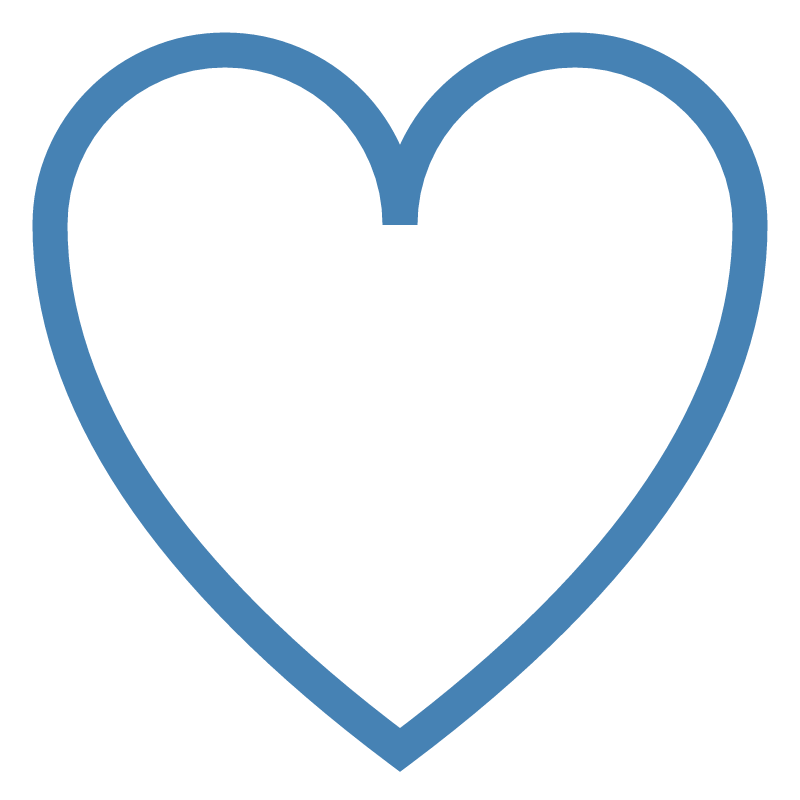

# svgpath

Parse, simplify & transforms SVG path easily in Rust.

[](https://crates.io/crates/svgpath)
[](https://docs.rs/svgpath)

## Example

Drawing SVG path using `tiny_skia`.

```rust
use svgpath::CommandF32;
use tiny_skia::*;

fn main() {
    let s = "
    M 10,30
    A 20,20 0,0,1 50,30
    A 20,20 0,0,1 90,30
    Q 90,60 50,90
    Q 10,60 10,30
    Z";

    // Parse the SVG path string
    let p = svgpath::parse(s).unwrap();

    // Convert to SimplePath
    let mut sp = p.simplify();

    // Scale and translate to fit inside 700 x 700 rectangle at X=50 and Y=50
    let rect = svgpath::Rect::new(50.0, 50.0, 700.0, 700.0);
    let final_path = sp.fit(&rect, true, true);

    // Draw the path using tiny_skia
    let mut pb = PathBuilder::new();
    for cmd in final_path.commands_f32() {
        // SimplePath consists only of absolute M, L, C and Z
        match cmd {
            CommandF32::Move { x, y } => pb.move_to(x, y),
            CommandF32::Line { x, y } => pb.line_to(x, y),
            CommandF32::Cubic {
                x1,
                y1,
                x2,
                y2,
                x,
                y,
            } => pb.cubic_to(x1, y1, x2, y2, x, y),
            CommandF32::Close => pb.close(),
            _ => {}
        }
    }
    let path = pb.finish().unwrap();

    let mut stroke = Stroke::default();
    stroke.width = 35.0;

    let mut paint = Paint::default();
    paint.set_color_rgba8(70, 130, 180, 255);
    paint.anti_alias = true;

    let mut pixmap = Pixmap::new(800, 800).unwrap();
    pixmap.fill(Color::WHITE);
    pixmap.stroke_path(&path, &paint, &stroke, Transform::identity(), None);
    pixmap.save_png("path.png").unwrap();
}
```

Result:


